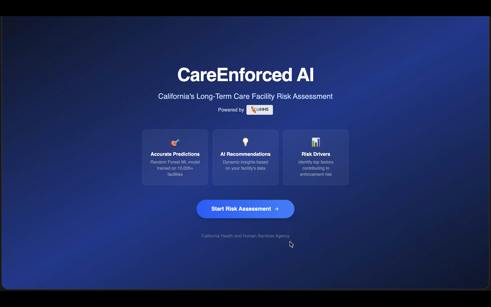

# CareEnforced AI

**AI-powered risk assessment system for California healthcare facilities**

CareEnforced AI is a dual-track machine learning platform that predicts regulatory enforcement risk for California healthcare facilities. It analyzes financial, operational, and staffing data to help facility administrators proactively identify compliance issues before penalties occur.

Click on the thumbnail below to play the full live demo recording of CareEnforced AI. 

[](livedemo-recording.mov)


## 🎯 Project Overview

### Two Prediction Systems

1. **Long-Term Care Facilities** - Nursing homes, skilled nursing facilities
   - **Best Model**: Enhanced XGBoost (ROC-AUC: 0.8035)
   - **Features**: 248 operational, financial, and staffing metrics
   - **Performance**: 66.27% precision, 54.11% recall

2. **Hospitals** - Acute care hospitals, medical centers
   - **Best Model**: LightGBM (ROC-AUC: 0.8021)
   - **Features**: 383 revenue, patient day, and utilization metrics
   - **Performance**: 52.94% precision, 30.00% recall

### Key Features

- ⚡ **Real-time Risk Assessment** - Instant predictions via FastAPI backend
- 📊 **Interactive Web Interface** - React/Vite frontend with dynamic forms
- 🎯 **Actionable Recommendations** - AI-generated compliance improvement suggestions
- 📈 **Feature Attribution** - Understand which factors drive risk scores
- 🏥 **Dual Facility Support** - Separate models optimized for hospitals vs. long-term care

---

## 📊 Analysis & Findings Summary

### Model Performance Comparison

#### Long-Term Care Facilities

| Model | ROC-AUC | F1-Score | Precision | Recall | Status |
|-------|---------|----------|-----------|--------|--------|
| **Enhanced XGBoost** ⭐ | **0.8035** | 0.5957 | 0.6627 | 0.5411 | **Recommended** |
| Ensemble (3-model) | **0.8054** | **0.6108** | 0.6231 | 0.5990 | Available |
| Enhanced Logistic Regression | 0.7661 | 0.6034 | 0.5447 | **0.6763** | High Recall |
| Enhanced Random Forest | 0.7812 | 0.5514 | 0.6258 | 0.4928 | Available |
| Baseline Random Forest | 0.7861 | 0.5376 | 0.6691 | 0.4493 | Legacy |

**Recommendation**: Use **Enhanced XGBoost** for production (best balance of precision/recall, no geographic bias)

#### Hospitals

| Model | Accuracy | ROC-AUC | Precision | Recall |
|-------|----------|---------|-----------|--------|
| **LightGBM** ⭐ | 0.8585 | **0.8021** | **0.5294** | 0.3000 |
| Random Forest | 0.8439 | 0.7950 | 0.4000 | 0.1333 |
| XGBoost | 0.8537 | 0.7644 | 0.5000 | 0.3000 |
| Logistic Regression | 0.8195 | 0.7036 | 0.3871 | 0.4000 |

### Key Insights

1. **Geographic Bias Removed**: All enhanced models exclude Los Angeles County features for fairness
2. **Recall Trade-offs**: Enhanced models prioritized catching violations (recall) over minimizing false alarms (precision)
3. **Ensemble Benefits**: 3-model ensemble offers highest overall performance but requires 3x storage/inference time
4. **Feature Engineering Impact**: Derived staffing ratios and financial margins significantly improved predictions
5. **Class Imbalance Handling**: Class weights and hyperparameter tuning improved minority class detection (+48% recall)

### Use Case Recommendations

- **Proactive Monitoring** → Enhanced XGBoost (balanced precision/recall)
- **Regulatory Enforcement** → Enhanced Logistic Regression (high recall 67.63%)
- **Mission-Critical Decisions** → Ensemble (highest accuracy, confidence scoring)
- **Research/Analysis** → Enhanced Random Forest (interpretable feature importances)

📖 **Detailed Analysis**: See [`docs/model_comparison.md`](docs/model_comparison.md) and [`docs/random_forest_model_details.md`](docs/random_forest_model_details.md)

---

## 🏗️ Project Architecture

### Technology Stack

**Frontend**
- React 18 with Vite
- React Router for navigation
- Recharts for visualizations
- TailwindCSS for styling

**Backend**
- FastAPI (Python 3.9+)
- scikit-learn, XGBoost, LightGBM
- Pandas, NumPy for data processing
- Uvicorn ASGI server

**Machine Learning**
- Random Forest, XGBoost, LightGBM, Logistic Regression
- Ensemble voting classifier
- SHAP for model interpretability
- RandomizedSearchCV for hyperparameter tuning

### Data Flow

```
User Input (Web Form)
    ↓
Frontend (React) → API Request
    ↓
Backend (FastAPI) → /predict endpoint
    ↓
Model Pipeline:
  1. Data Validation
  2. Feature Engineering
  3. Preprocessing (Imputation, Scaling, Encoding)
  4. Model Prediction (XGBoost/LightGBM)
  5. Feature Attribution
  6. Recommendation Generation
    ↓
JSON Response → Frontend
    ↓
Results Display (Risk Score, Drivers, Recommendations)
```

---

## 📁 Directory Structure

```
FinalProject/
│
├── backend/                    # FastAPI backend server
│   ├── main.py                # API endpoints (/predict, /predict-hospital)
│   ├── model.py               # Long-term care model wrapper
│   ├── ensemble_model.py      # Ensemble prediction logic
│   ├── requirements.txt       # Python dependencies
│   ├── top_features.json      # Feature importance metadata
│   └── venv/                  # Python virtual environment
│
├── frontend/                   # React/Vite frontend
│   ├── src/
│   │   ├── pages/
│   │   │   ├── HospitalInput.jsx    # Hospital prediction form
│   │   │   └── LongTermInput.jsx    # Long-term care form
│   │   ├── components/
│   │   │   ├── ResultsPage.jsx      # Prediction results display
│   │   │   └── ...
│   │   └── App.jsx            # Main application router
│   ├── package.json           # Node.js dependencies
│   └── vite.config.js         # Vite build configuration
│
├── models/                     # Trained ML models (PKL files)
│   ├── xgboost_model.pkl              # ⭐ Long-term care (recommended)
│   ├── risk_model_enhanced.pkl        # Symlink to XGBoost
│   ├── random_forest_model.pkl        # Long-term care RF
│   ├── logistic_regression_model.pkl  # Long-term care LR
│   ├── ensemble_metadata.json         # Ensemble weights
│   ├── hospital_lightgbm_model.pkl    # ⭐ Hospital model
│   └── hospital_model_metadata.json   # Hospital feature mapping
│
├── scripts/                    # Training & analysis scripts
│   ├── train_model_enhanced.py        # Main training (long-term care)
│   ├── train_hospital_model_for_app.py # Hospital model training
│   ├── train_hospital_models.py       # Hospital model comparison
│   ├── compare_models.py              # Model performance comparison
│   ├── visualize_model_performance.py # Performance visualizations
│   ├── visualize_shap.py              # SHAP interpretability
│   ├── clean_data.py                  # Data preprocessing
│   ├── merge_data.py                  # Merge 2022 + 2024 datasets
│   └── ...                            # Additional utilities
│
├── data/                       # Datasets
│   ├── raw/                           # Original Excel files
│   │   ├── longterm_care_v2_2022.xlsx
│   │   ├── longterm_care_v2_2024.xlsx
│   │   ├── hospital_v2_2022.xlsx
│   │   └── hospital_v2_2024.xlsx
│   └── processed/                     # Cleaned CSV files
│       ├── longterm_care_cleaned.csv  # 248 features, 4,831 facilities
│       ├── hospital_cleaned.csv       # 383 features, 1,025 hospitals
│       ├── longterm_care_22_24.csv    # Merged raw data
│       └── hospital_22_24.csv         # Merged raw hospital data
│
├── docs/                       # Long-term care documentation
│   ├── model_comparison.md            # Comprehensive model guide
│   ├── random_forest_model_details.md # RF architecture & performance
│   ├── cleaned_data_dictionary.md     # Feature definitions
│   ├── geographic_feature_removal_summary.md  # Bias mitigation
│   ├── workflow_explanation.md        # Development timeline
│   └── ...
│
├── docs-hospitals/             # Hospital documentation
│   ├── hospital_model_comparison.md   # Hospital model performance
│   └── hospital_data_dictionary.md    # Hospital feature definitions
│
├── config/                     # Configuration files
│   └── feature_mapping.json           # Feature name translations
│
├── output/                     # Analysis outputs
│   └── missing_data_columns.md        # Data quality report
│
├── start_app.sh               # 🚀 One-command app launcher
├── README.md                  # This file
└── DEPLOYMENT.md              # Deployment instructions (Render, Vercel)
```

---

## 🚀 Quick Start

### Prerequisites
- **Python 3.9+**
- **Node.js 18+**
- **Git** (to clone the repository)

### Option 1: Automated Start (Recommended)

1. **Clone the repository**:
   ```bash
   git clone https://github.com/christopheroueis/IAI-final-CAHealthEnforcement.git
   cd IAI-final-CAHealthEnforcement
   ```

2. **Make the start script executable** (first time only):
   ```bash
   chmod +x start_app.sh
   ```

3. **Run the app**:
   ```bash
   ./start_app.sh
   ```

4. **Open your browser** to [http://localhost:5173](http://localhost:5173)

### Option 2: Manual Start

**Backend**:
```bash
cd backend
../.venv/bin/python -m uvicorn main:app --reload --host 0.0.0.0 --port 8000
```

**Frontend** (in a new terminal):
```bash
cd frontend
npm install  # First time only
npm run dev -- --host
```

**Note**: The backend uses a shared virtual environment at `.venv/` in the project root.

---

## 🧠 Model Training

### Training Scripts Overview

| Script | Purpose | Output |
|--------|---------|--------|
| `scripts/train_model_enhanced.py` | **Main training script** for long-term care models | `xgboost_model.pkl`, `random_forest_model.pkl`, `logistic_regression_model.pkl` |
| `scripts/train_hospital_model_for_app.py` | Hospital model training | `hospital_lightgbm_model.pkl` |
| `scripts/compare_models.py` | Benchmarks all models | Performance comparison reports |
| `scripts/visualize_model_performance.py` | Generates performance charts | ROC curves, confusion matrices |
| `scripts/extract_top_features.py` | Extracts feature importances | `top_features.json` |

### Retraining Models

To retrain the long-term care models:

```bash
cd scripts
../.venv/bin/python train_model_enhanced.py
```

To retrain the hospital model:

```bash
cd scripts
../.venv/bin/python train_hospital_model_for_app.py
```

**Note**: Training requires the cleaned datasets in `data/processed/`. Models are saved to `models/` directory.

### Training Pipeline

1. **Data Loading** → `data/processed/longterm_care_cleaned.csv` or `hospital_cleaned.csv`
2. **Feature Engineering** → Staffing ratios, financial margins, derived metrics
3. **Preprocessing** → Imputation (mean/mode), StandardScaler, OneHotEncoder
4. **Hyperparameter Tuning** → RandomizedSearchCV with 3-fold cross-validation
5. **Model Training** → Fit on 80% train set with class weights
6. **Evaluation** → Test on 20% holdout set
7. **Serialization** → Save trained pipeline as `.pkl` file

📖 **Detailed Training Documentation**: See [`docs/workflow_explanation.md`](docs/workflow_explanation.md)

---

## 📊 Data Sources

### Long-Term Care Facilities

**Source**: California Department of Health Care Access and Information (HCAI)  
**Files**: `longterm_care_v2_2022.xlsx`, `longterm_care_v2_2024.xlsx`  
**Records**: 4,831 facilities (2022 + 2024 combined)  
**Features**: 248 after cleaning (606 original, 358 dropped due to >50% missing data)

**Key Feature Categories**:
- Financial: Revenue, expenses, net income, margins
- Operational: Licensed beds, patient days, discharge patterns
- Staffing: RN/LVN/CNA hours per patient day
- Geographic: County, Health Service Area (HSA)

### Hospitals

**Source**: California HCAI Hospital Annual Financial Data  
**Files**: `hospital_v2_2022.xlsx`, `hospital_v2_2024.xlsx`  
**Records**: 1,025 hospitals  
**Features**: 383 after cleaning (600 original, 217 dropped)

**Key Feature Categories**:
- Revenue: Gross patient revenue, net revenue by payer
- Utilization: Patient days, discharges, visits, length of stay
- Expenses: Daily, ancillary, administrative
- Staffing: Full-time equivalents (FTE)

📖 **Data Dictionaries**: 
- [`docs/cleaned_data_dictionary.md`](docs/cleaned_data_dictionary.md) (Long-term care)
- [`docs-hospitals/hospital_data_dictionary.md`](docs-hospitals/hospital_data_dictionary.md) (Hospitals)

---

## 🚢 Deployment

The application can be deployed to cloud platforms like **Render** (recommended), **Vercel**, or **Railway**.

📖 **Full deployment instructions**: See [`DEPLOYMENT.md`](DEPLOYMENT.md)

### Quick Deploy to Render

1. Sign up at [render.com](https://render.com)
2. Connect your GitHub repository
3. Deploy **Backend** as a Web Service:
   - Root Directory: `backend`
   - Build Command: `pip install -r requirements.txt`
   - Start Command: `uvicorn main:app --host 0.0.0.0 --port $PORT`
4. Deploy **Frontend** as a Static Site:
   - Root Directory: `frontend`
   - Build Command: `npm install && npm run build`
   - Publish Directory: `dist`
   - Environment Variable: `VITE_API_URL=<your-backend-url>`

---

## 📚 Documentation Index

### Model Documentation
- [**Model Comparison Guide**](docs/model_comparison.md) - Comprehensive comparison of all models with use case recommendations
- [**Random Forest Model Details**](docs/random_forest_model_details.md) - Architecture, training, and performance
- [**Hospital Model Comparison**](docs-hospitals/hospital_model_comparison.md) - Hospital-specific model benchmarks
- [**Geographic Feature Removal**](docs/geographic_feature_removal_summary.md) - Bias mitigation approach

### Data Documentation
- [**Long-Term Care Data Dictionary**](docs/cleaned_data_dictionary.md) - Feature definitions and meanings
- [**Hospital Data Dictionary**](docs-hospitals/hospital_data_dictionary.md) - Hospital feature reference
- [**Column Dictionary**](docs/column_dictionary.md) - Abbreviated column name mappings
- [**Workflow Explanation**](docs/workflow_explanation.md) - Development timeline and process

### Performance Reports
- [**Enhanced Model Performance**](docs/enhanced_model_performance.md) - Results from hyperparameter tuning
- [**EDA Report**](docs/eda_report.md) - Exploratory data analysis findings
- [**Missing Data Analysis**](output/missing_data_columns.md) - Data quality assessment

---

## 🎯 Model Selection Quick Reference

**Need the best overall accuracy?**  
→ Use **Enhanced XGBoost** (Long-term care) or **LightGBM** (Hospitals)

**Need to catch all violations (high recall)?**  
→ Use **Enhanced Logistic Regression** (67.63% recall)

**Need explainable predictions for regulators?**  
→ Use **Logistic Regression** (coefficient-based explanations)

**Need maximum confidence in predictions?**  
→ Use **3-Model Ensemble** (model agreement scoring)

**Need fast inference and small model size?**  
→ Use **Logistic Regression** (~2MB, <10ms)

📖 **Detailed decision guide**: [`docs/model_comparison.md`](docs/model_comparison.md)

---

## 🔧 Development

### Backend API

**Base URL**: `http://localhost:8000`

**Endpoints**:
- `POST /predict` - Long-term care facility risk prediction
- `POST /predict-hospital` - Hospital risk prediction
- `GET /health` - Health check endpoint

**Example Request** (`/predict`):
```json
{
  "TOT_LIC_BEDS": 120,
  "PRDHR_RN_Per_Day": 0.85,
  "PRDHR_NA_Per_Day": 2.5,
  "Net_Income_Margin": -0.03,
  "COUNTY_x_Los Angeles": 0
}
```

**Example Response**:
```json
{
  "risk_score": 0.68,
  "risk_level": "Medium",
  "top_risk_drivers": [
    {
      "feature": "RN Hours per Patient Day",
      "contribution": 14.2,
      "importance": 0.0132
    }
  ],
  "recommendations": [
    {
      "title": "Increase RN Staffing",
      "description": "Current RN hours are below recommended...",
      "impact": "high"
    }
  ]
}
```

---

## 📱 Mobile Demo

To demo on your phone:
1. Ensure computer and phone are on the same Wi-Fi network
2. Run `./start_app.sh`
3. Note the network URL displayed (e.g., `http://192.168.1.x:5173`)
4. Open that URL on your phone's browser

---

## 🙏 Acknowledgments

**Data Source**: California Department of Health Care Access and Information (HCAI)  
**Course**: 95891 - Introduction to Artificial Intelligence, Fall 2025  
**Institution**: [Your Institution Name]

---

## 📄 License

This project is for educational purposes as part of a university course assignment.

---

**Last Updated**: December 2025  
**Repository**: https://github.com/christopheroueis/IAI-final-CAHealthEnforcement  
**Contact**: Christopher Oueis
